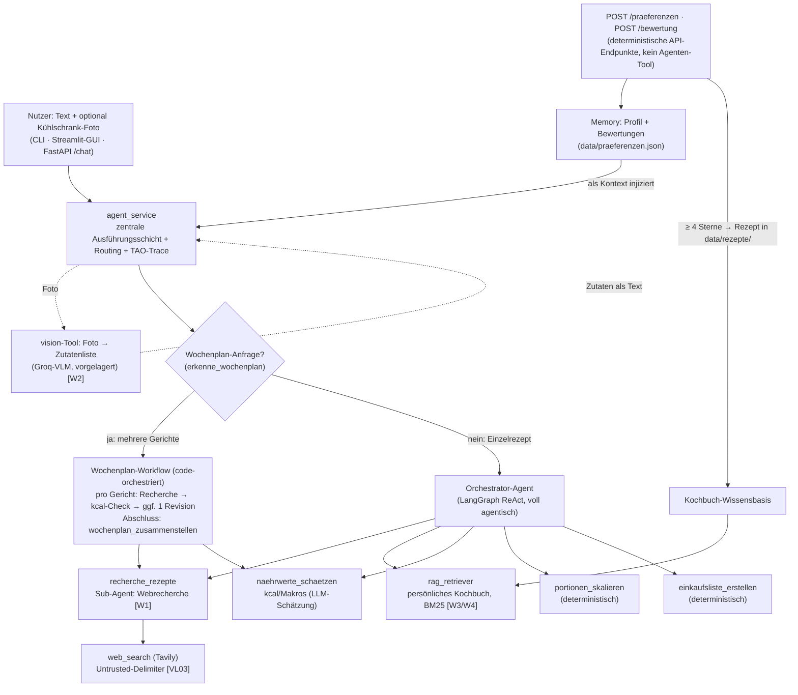

# PROJEKTDOKU — RezeptAgent

*Ausführliche Projektdokumentation: Architektur, Designentscheidungen, Funktionsweise,
Grenzen. Die [README](../README.md) bleibt bewusst schlank (Quickstart + Überblick)
und verlinkt hierher. Jede Behauptung in diesem Dokument ist durch Code oder eine
Evidence-Datei unter [docs/evidence/](evidence/) gedeckt; der formale
Anforderungs-Nachweis (P1–P5, W1–W14) steht in der
[Bewertungsmatrix](bewertungsmatrix.md).*

Inhalt:
1. [Problem & Domäne](#1-problem--domäne)
2. [Architektur](#2-architektur)
3. [Funktionsweise: der TAO-Zyklus an einem echten Lauf](#3-funktionsweise-der-tao-zyklus-an-einem-echten-lauf)
4. [Konzept→Kurs-Mapping](#4-konzeptkurs-mapping)
5. [Grenzen des Systems](#5-grenzen-des-systems)
6. [Was wir anders machen würden](#6-was-wir-anders-machen-würden)

---

## 1. Problem & Domäne

**Was löst der RezeptAgent?** Er beantwortet die Alltagsfrage „Was koche ich — mit
dem, was ich habe, und so, wie ich esse?": Rezepte finden per Texteingabe oder
Kühlschrank-Foto, fehlende Zutaten als Einkaufsliste ergänzen, Mengen auf die
Personenzahl umrechnen, Kalorien-Vorgaben prüfen und mehrere Abendessen zu einem
Wochenplan mit gemeinsamer Einkaufsliste zusammenstellen — unter dauerhaften
Vorgaben der Person (vegan, glutenfrei, …) und gelernten Vorlieben (Bewertungen).

**Für wen?** Einen einzelnen Haushalt/Nutzer, lokal betrieben (CLI, GUI oder API);
das System ist bewusst Single-User (siehe [Grenzen](#5-grenzen-des-systems)).

**Was macht die Aufgabe agentisch — statt LLM-Wrapper?** Drei Eigenschaften, die
ein einzelner LLM-Aufruf nicht leisten kann:

1. **Constraints, gegen die geprüft und revidiert wird.** „Max. 500 kcal pro
   Portion" ist keine Formulierungsbitte, sondern eine Bedingung: Das System
   schätzt die Kalorien per Tool, vergleicht **im Code** gegen das Limit und
   revidiert bei Verletzung die Rezeptwahl
   ([wochenplan_workflow.py](../app/core/wochenplan_workflow.py), realer Beleg:
   [Referenz-Trace (b)](evidence/referenz_traces.md)).
2. **Planung über mehrere Schritte.** Ein Wochenplan erfordert pro Gericht
   Recherche → Prüfung → ggf. Revision, plus Abwechslung zwischen den Gerichten
   und am Ende eine aggregierte Einkaufsliste — eine `plan→prüfe→revidiere`-
   Schleife, kein Einzel-Prompt.
3. **Unsichere Websuche als Umgebung.** Die Recherche kann leer ausgehen,
   scheitern oder Unpassendes liefern; der Agent muss das erkennen und den Weg
   wechseln (Fallback auf eigenes Wissen, transparent gekennzeichnet — Beleg:
   [Referenz-Trace (c)](evidence/referenz_traces.md)). Tool-Wahl und Schrittzahl
   hängen an der Situation, nicht an einer festen Pipeline (vier verschiedene
   Trajektorien desselben Agenten: [referenz_traces.md](evidence/referenz_traces.md)).

## 2. Architektur

**Zwei Verarbeitungswege, bewusst getrennt:** Eine Einzelrezept-Anfrage geht an den
**voll agentischen** Orchestrator, der situationsabhängig Tools wählt (TAO-Zyklus).
Ein **Wochenplan** (mehrere Gerichte) geht an einen **code-orchestrierten
Workflow**, weil Modelle die Mehrschritt-Koordination nicht zuverlässig per Prompt
befolgen (Begründung unter [Wochenplan-Workflow](#22-wochenplan-workflow)).

Für jede Komponente gilt der Grundsatz: **Etwas wird nur dann ein eigener
(Sub-)Agent, wenn Kontext-Isolation echten Mehrwert bringt — sonst Tool.** Das hält
die Architektur ehrlich statt aufgebläht.

### 2.1 agent_service — die eine Ausführungsschicht

- **Warum existiert sie?** CLI ([main.py](../main.py)), FastAPI
  ([app/api/main.py](../app/api/main.py)) und Streamlit-GUI
  ([streamlit_app.py](../streamlit_app.py)) starten den Agenten alle über
  **eine** Funktion `run_rezept_agent`
  ([app/core/agent_service.py](../app/core/agent_service.py)) — kein doppelter
  Code, eine testbare Stelle. Sie verarbeitet das optionale Foto, injiziert das
  Profil, routet zwischen Workflow und Orchestrator und schneidet den TAO-Trace mit.
- **Alternative erwogen:** Agent-Aufruf je Frontend. Verworfen — drei Kopien
  derselben Logik hätten bei jeder Änderung dreifach gepflegt werden müssen.

### 2.2 Orchestrator (LangGraph ReAct) — Framework- und Modellwahl

- **Warum existiert er?** Er ist der „Manager": versteht die Anfrage, wählt
  situationsabhängig Tools/Sub-Agent im TAO-Zyklus, setzt harte Vorgaben durch
  (Prompt-Regel 0: Ernährungsvorgaben „NIEMALS verletzen") und formuliert die
  Antwort ([app/agents/orchestrator.py](../app/agents/orchestrator.py)).
- **Framework: LangGraph** (P3) — gewählt wegen nativer ReAct-Unterstützung
  (`create_react_agent`), einfacher Tool-Integration und guter Erweiterbarkeit für
  Multi-Agent-Setups. *Alternative erwogen:* smolagents (aus der VL) — dessen
  Kernidee ist code-ausführende Agenten, was eine Angriffsfläche öffnet, die wir
  bewusst nicht haben wollen (siehe [Sicherheit](#28-sicherheits-design-vl03));
  eine handgeschriebene TAO-Schleife hätte P3 (etabliertes Framework) verfehlt und
  Streaming/Tool-Binding neu erfunden.
- **Modell: Groq `qwen/qwen3-32b`** — kostenlos, schnell, **zuverlässiges
  Tool-Calling**. Diese Wahl ist erarbeitet, nicht geraten: `llama-3.3-70b`
  erzeugt auf Groq zeitweise ein defektes Tool-Call-Format (`tool_use_failed`,
  jede Recherche schlägt fehl); `openai/gpt-oss-120b` ist für den call-schweren
  Wochenplan zu langsam (mehrere Minuten). Reasoning-Ausgaben (`<think>…`) werden
  vor der Nutzerantwort gefiltert
  ([app/core/text_utils.py](../app/core/text_utils.py)). Umstellbar über
  `GROQ_MODEL`.
- **`parallel_tool_calls=False`** ([orchestrator.py:113](../app/agents/orchestrator.py#L113)):
  erzwingt EINEN Tool-Aufruf pro Schritt. Sonst batchen Modelle mehrere Tools in
  einen Schritt und umgehen den sequenziellen TAO-Zyklus — der aber der sichtbare
  Kern der Bewertungs-Dimension 2 ist.

### 2.3 Recherche-Sub-Agent — der einzige echte Sub-Agent

- **Warum ein eigener Agent (statt `web_search` direkt am Orchestrator)?**
  Websuche liefert viele, unstrukturierte Treffer („Rauschen"). Der Sub-Agent
  ([app/agents/recherche_agent.py](../app/agents/recherche_agent.py)) verarbeitet
  sie in **eigenem Kontext** (ggf. mehrere Suchen, Auswertung) und gibt dem
  Orchestrator nur eine kompakte Rezeptliste (max. 1200 Zeichen) zurück →
  **Kontext-Isolation** (VL4). Aus Orchestrator-Sicht ist er ein Tool mit einem
  Parameter („Sub-Agent = Function Call", VL4).
- **Warum lohnt die Isolation hier — und sonst nirgends?** Nur die Websuche
  produziert unkontrolliert viel Kontext-Müll. Nährwert-Schätzung, Skalierung,
  Einkaufsliste sind abgeschlossene Einzelschritte ohne eigenen Mehrschritt-Loop —
  ein Sub-Agent wäre dort nur Fassade. Deshalb: ein Sub-Agent, fünf Tools.
- **Begrenzung:** nur `web_search` als Tool, `recursion_limit=6` — Excessive-
  Agency-Deckel (VL03), Details in [sicherheit.md](sicherheit.md).

### 2.4 Wochenplan-Workflow — bewusste Korrektur nach gescheitertem Ansatz

Der lehrreichste Teil des Projekts
([app/core/wochenplan_workflow.py](../app/core/wochenplan_workflow.py)).

- **Warum überhaupt?** „Plane mir 3 Abendessen, max. 500 kcal pro Portion, für
  2 Personen, vegetarisch" ist keine Ein-Rezept-Frage, sondern **Planung über
  mehrere Schritte**: pro Gericht recherchieren, gegen den kcal-Constraint prüfen,
  bei Verletzung **revidieren**, für Abwechslung sorgen, am Ende eine gemeinsame
  Einkaufsliste bauen (`plan → prüfe → revidiere`). Das ist der Kern der
  Bewertungs-Dimension 2.
- **Warum ein code-orchestrierter Workflow statt eines voll-agentischen Prompts?**
  Wir haben den Wochenplan **zuerst rein agentisch** gebaut (der Orchestrator
  koordiniert alle Schritte per Prompt). In echten Läufen befolgte **kein**
  getestetes Modell die Reihenfolge zuverlässig: `llama-3.3-70b` übersprang den
  Nährwert-Check und den Abschluss; `gpt-oss-120b` recherchierte obsessiv (7×
  statt 2×) und kam nicht zum Ziel. Mehr Prompt-„PFLICHT" half nicht — die
  zuverlässige Koordination einer Mehrschritt-Schleife liegt an der Grenze dessen,
  was ein Modell per Prompt leistet. Deshalb steuert jetzt der **Code** die
  Schritt-Reihenfolge deterministisch, während das **LLM die inhaltlichen
  Entscheidungen** trifft (welches Rezept aus den Treffern, finale Formulierung).
  Muster: **„Workflow für die Struktur, Agent für den Inhalt."** Die
  `plan→prüfe→revidiere`-Schleife ist damit **garantiert** im Trace sichtbar,
  unabhängig von der Prompt-Befolgung. Realer Beleg:
  [wochenplan_trace.md](evidence/wochenplan_trace.md).
- **Der Einzelrezept-Modus bleibt voll agentisch** — dort ist situationsabhängige
  Tool-Wahl der Mehrwert, und ein einzelnes Rezept braucht keine erzwungene
  Schleife. Der Workflow greift nur bei echten Mehr-Gerichte-Anfragen
  (`erkenne_wochenplan`: Regex-Vorfilter, dann LLM-Parameter-Extraktion — ohne
  Wochenplan-Hinweis im Text kostet das keinen Extra-LLM-Call).
- **Was bleibt deterministisch:** Der kcal-Vergleich gegen das Limit passiert
  **im Code** (`kcal > kcal_limit`), nicht im Modell-„Kopfrechnen";
  `wochenplan_zusammenstellen` ([app/tools/wochenplan.py](../app/tools/wochenplan.py))
  aggregiert die Zutaten aller Gerichte zu **einer** deduplizierten Einkaufsliste
  (dieselbe Kernbegriff-Logik wie `einkaufsliste_erstellen`, wiederverwendet).
- **Ehrliche Grenzen:** (1) Die Dedup kann Verwandtes über-verschmelzen („Paprika
  rot"/„Paprika grün"); Mengen werden über Gerichte **nicht** aufsummiert — die
  Liste sagt *was* einzukaufen ist, nicht *wie viel*. (2) Mehrere LLM-Calls pro
  Gericht → token-intensiv; das Groq-Free-Tier hat Minuten- (TPM) und Tages-Limits
  (TPD 100k), die bei intensivem Testen erschöpfen (429). Gegenmaßnahmen:
  `max_retries=5`, Recherche auf 3 Treffer + 1200 Zeichen begrenzt, Gerichte-Deckel
  (max. 7). Ein einzelner Wochenplan läuft mit frischem Budget durch.

### 2.5 Die Tools — und warum jedes seine Form hat

| Tool | Form | Warum diese Form (und nicht anders) |
|------|------|-------------------------------------|
| [web_search](../app/tools/web_search.py) | Tavily-Suche, nur im Sub-Agent | Liefert nur Text, ruft nichts weiter auf; Treffer in Untrusted-Delimiter (VL03) |
| [rag_retriever](../app/tools/kochbuch.py) | BM25 über `data/rezepte/` | Retriever als **Tool**, damit der Agent *entscheidet*, wann er sucht (Agentic RAG, s. u.) |
| [naehrwerte_schaetzen](../app/tools/naehrwerte.py) | LLM-Schätzung → Zahl | Constraint-Check braucht eine Zahl; Fehler → `NAEHRWERT-FEHLER` statt „0 kcal" (s. u.) |
| [portionen_skalieren](../app/tools/skalierung.py) | reine Arithmetik | Mengen-Rechnen muss exakt sein — genau da verrechnen sich LLMs; Prompt: „Rechne Mengen niemals selbst im Kopf" |
| [einkaufsliste_erstellen](../app/tools/shopping_list.py) | reine Logik | Fehlende Zutaten bestimmen ist Mengen-/Mengenlehre, kein Sprachproblem |
| [wochenplan_zusammenstellen](../app/tools/wochenplan.py) | reine Logik | Deterministische Aggregation als garantierter Abschluss des Workflows |
| [vision](../app/tools/vision.py) | Groq-VLM, **vorgelagert** | Foto → Zutatenliste läuft **vor** dem Orchestrator: Der bleibt rein text-/tool-basiert, und der Nutzer kann die erkannten Zutaten bestätigen (Human-in-the-Loop). Realer Nachweis: [vision_nachweis.md](evidence/vision_nachweis.md) |

**`naehrwerte_schaetzen` — Nährwerte als Constraint, nicht als Deko.** Nennt der
Nutzer eine kcal-Vorgabe, wird daraus eine Bedingung, die aktiv geprüft wird.
*Warum LLM-Schätzung statt Nährwert-Datenbank?* Der Kursrahmen ist bewusst
kostenlos/reproduzierbar (kein USDA-/OpenFoodFacts-Konto); für eine grobe
Planungs-Größenordnung genügt die Schätzung — die ehrliche Grenze dazu steht in
[Abschnitt 5](#5-grenzen-des-systems). *Warum Tool und kein Agent?* Abgeschlossener
Einzelschritt ohne eigenen Loop.

**Fehler werden zur Entscheidung, nicht zum Absturz.** Wo ein Fehlschlag eine
*agentische* Reaktion erlaubt, geben Tools eine klare **Observation** zurück statt
eine Exception zu werfen — der Orchestrator kann dann einen anderen Weg wählen:
`WEBSUCHE-LEER`/`WEBSUCHE-FEHLER`/`RECHERCHE-FEHLER` → Fallback auf eigenes Wissen
(transparent gekennzeichnet); `NAEHRWERT-FEHLER` → kcal-Vorgabe gilt als *nicht
geprüft* — bewusst **kein** „0 kcal", das der Agent fälschlich als „unter dem
Limit" deuten würde. Rein **technische** Fehler (Vision-Timeout, Rate-Limit,
Netzwerk) fängt dagegen die Service-/API-Schicht graceful ab (W9): Die
Vision-Analyse degradiert zu „ohne Foto-Zutaten weiterarbeiten", CLI und
FastAPI-Route liefern eine klare Meldung statt eines Stacktrace; alle LLM-Aufrufe
haben `max_retries=5` gegen transiente 429. Getestet in
[tests/test_fehlerhandling.py](../tests/test_fehlerhandling.py).

### 2.6 Kochbuch-RAG — die Wissensbasis, die der Agent sich selbst kocht (W3/W4)

**Was:** Rezepte, die der Nutzer mit **≥ 4 Sternen** bewertet, wandern automatisch
als JSON in die Wissensbasis (`data/rezepte/`, plus gekennzeichnete Seed-Rezepte
gegen den Kaltstart). `rag_retriever`
([app/tools/kochbuch.py](../app/tools/kochbuch.py)) durchsucht sie per **BM25**;
der Orchestrator ruft es **zuerst** auf, wenn sich der Nutzer auf Bewährtes
bezieht („meine Lieblingsrezepte", „wie letztes Mal"; Prompt-Regel 2b), und
wechselt bei `RAG-LEER` transparent zur Websuche → **Agentic RAG** (W4,
situationsabhängige Tool-Wahl, gemessen im Eval-Fall `favoriten_rag`).

- **Warum dieser Inhalt?** Eine Wissensbasis voller Web-Rezepte wäre Checkbox-RAG —
  das kann die Websuche schon. Mehrwert entsteht, wenn die Basis enthält, was Web
  und LLM **nicht wissen können**: die eigenen, bewährten Rezepte. Damit ist das
  Continual-Learning-Konzept (W13) konkret implementiert: Bewertung → Basis →
  künftige Vorschläge.
- **Warum BM25 statt Embedding-Modell + Vektor-DB?** (1) Der Korpus ist klein und
  wächst pro gekochtem Gericht um eins — Embedding-Nutzen minimal, Kosten real:
  Der erste RAG-Anlauf scheiterte an einem 2,27-GB-Modell-Download im laufenden
  Request (GUI-Timeout) plus Implementierungsfehlern; das Modul wurde ersetzt und
  aus dem Repo entfernt (Historie: [handover.md](handover.md)). (2) VL-Erkenntnis: lexikalische Suche + **agentische
  Query-Umformulierung** schlägt naive One-Shot-Vektorsuche — die „Semantik"
  liefert das LLM, das bei `RAG-LEER` Synonyme probiert. (3) Deterministisch,
  offline testbar, kein Download: Der Kursrahmen (kostenlos, reproduzierbar)
  bleibt intakt. BM25 ist bewusst **selbst implementiert** (~40 Zeilen) statt als
  Bibliothek gezogen.
- **Schreiben ist kein Agenten-Tool:** Der Eintrag ins Kochbuch passiert im
  deterministischen API-Pfad (`POST /bewertung`, ≥ 4 Sterne), nie durch das LLM
  (VL03: minimale Rechte; das Tool liest nur).

### 2.7 Memory: Profil + Bewertungen — Kontext statt Tool

([app/core/praeferenzen.py](../app/core/praeferenzen.py), Onboarding in der GUI)

- **Warum überhaupt?** Beim ersten Start läuft eine kurze Onboarding-Fragerunde
  (Geschmacks-Tendenz + „was ist dir bei Gerichten wichtig?"); dazu kommen
  Sterne-Bewertungen als gelerntes Signal. Der Agent reagiert dadurch
  **unterschiedlich je nach Nutzer** (Memory, Dim 2/6) — belegt im Eval
  (`vegan_profil`, `konflikt_salami_vegetarisch`).
- **Warum injiziert, nicht als Tool?** **Lesen = Kontext, Schreiben = Aktion.**
  Das dauerhafte Signal wird in die Eingabe injiziert; ein Tool „lies das Profil
  deines eigenen Nutzers" wäre Pseudo-Agentik. Profil setzen und Bewerten sind
  reines Persistieren → deterministische API-Aktionen (`POST /praeferenzen`,
  `POST /bewertung`), kein Agenten-Tool.
- **Warum Formular statt LLM-Chat-Onboarding?** Ein strukturiertes Formular
  liefert validierte, reproduzierbare Profildaten (W9-Linie) und ist testbar; ein
  Chat-Onboarding wäre „agentischer", aber fragil.
- **Warum JSON statt Datenbank?** Ein Nutzer, wenige Daten → eine transparente,
  versionierbare, testbare Datei (`data/praeferenzen.json`); ein DBMS wäre Overkill.

**Eingabekanäle — getrennt nach Härte und Dauer.** Die ursprüngliche
Pro-Anfrage-Filterliste wurde bewusst **entfernt**: Diätform/Unverträglichkeit
sind *dauerhafte Eigenschaften der Person* (vegan = immer vegan) und gehören ins
Onboarding-Profil als harte Dauer-Vorgabe, nicht in eine Liste, die man pro Rezept
neu anklickt.

| Kanal | Art | Geltung | Beispiele |
|-------|-----|---------|-----------|
| **Ernährung/Unverträglichkeit** | **hart** (gilt immer) | dauerhaft (Profil) | vegan, glutenfrei, laktosefrei |
| **Sonstige Wünsche** (Freitext) | weich, frei | nur diese Anfrage | „wenig Fleisch", „heute schnell" |
| **Geschmacksrichtung** | weich (Standard aus Profil) | diese Anfrage, vorbelegt | scharf, mediterran, süßlich |
| **Profil: Prioritäten + Bewertungen** | weich (wird bevorzugt) | dauerhaft (Memory) | „gesund", gut bewertete Rezepte |

**Standard vs. Tagesform:** Geschmack ist nicht rein dauerhaft (mal hat man Lust
auf Süßes). Lösung ohne Redundanz: Das Profil ist der **Standard**, die
Pro-Anfrage-Auswahl die **Tagesform** — dieselbe Auswahl wird aus dem Profil
vorbelegt und ist frei änderbar. Das Profil ist eine weiche Vorgabe; der Prompt
fordert zusätzlich aktiv **Abwechslung** ein.

### 2.8 Sicherheits-Design (VL03)

Der Recherche-Sub-Agent verarbeitet echte **Web-Inhalte** — Indirect Prompt
Injection ist real, nicht theoretisch. Das vollständige Threat-Model
(Lethal-Trifecta-Analyse, Excessive-Agency-Check je Komponente, Defense-in-Depth-
Schichten, Injection-Test) steht in [sicherheit.md](sicherheit.md); Test:
[tests/test_sicherheit.py](../tests/test_sicherheit.py). Die Design-Essenz:

- **Belastbarste Verteidigung ist die minimale Angriffsfläche**, nicht
  Prompt-Vertrauen: kein Code-Execution-, Datei- oder Netz-Sink; Schreiben nur
  über deterministische API-Endpunkte. Selbst ein „übernommener" Sub-Agent könnte
  nur Websuchen absetzen — die Lethal Trifecta ist an zwei von drei Gliedern
  gebrochen (keine Secrets im Kontext, kein Exfiltrations-Kanal).
- Web-Treffer laufen als untrusted Daten durch Delimiter
  ([web_search.py:57](../app/tools/web_search.py#L57)); der Sub-Agent hat genau
  ein Tool und einen Schritt-Deckel; jede Such-Query wird geloggt.
- **Ehrlich:** Prompt Injection ist nicht sicher lösbar; alle Maßnahmen sind
  bewusst Mitigationen (Abschnitt 5).

### 2.9 Observability: Traces & Spans statt loser Log-Zeilen (W5, VL09)

Jeder Agent-Run bekommt eine **`trace_id`** (ContextVar), die automatisch an jedem
JSON-Log-Eintrag hängt; jeder Teilschritt — LLM-Thought, Tool-Call,
Sub-Agent-Delegation, finale Antwort — wird als **Span-artiger Eintrag** mit
`span_typ`, `dauer_ms`, `status` geloggt
([app/core/logging_config.py](../app/core/logging_config.py),
[agent_service.py](../app/core/agent_service.py)); optional (`AGENT_TRACE_DIR`)
landet der komplette Run als **eine** JSON-Datei auf der Platte — dieselbe Quelle,
die Eval-Runner und Evidence-Skripte nutzen.

- *Warum kein Langfuse/OTel-Backend?* Ein Nutzer, lokaler Betrieb, kein Team —
  eine Tracing-Plattform wäre ungenutzte Infrastruktur (ehrliche Grenze). Das
  Schema ist absichtlich an die Trace/Span-Idee der OpenTelemetry-GenAI-Konvention
  (VL09) angelehnt, damit der Umstieg nur ein Export-Backend wäre, kein Umbau.
- Observability ist hier zugleich **Sicherheitsmaßnahme** (VL03): Die Span-Logs
  sind das Audit-Log der Tool-Calls, an dem anomale Muster (z. B. eine
  injection-getriggerte Recherche-Schleife) erkennbar wären.

### 2.10 Eval-Harness: Constraint-Treue messen statt behaupten (VL09)

Ob der Agent Constraints einhält, wird gemessen: [evals/](../evals/) enthält ein
Offline-Testset (**15 Fälle, davon 3 bewusst schwere**, an denen der Agent
voraussichtlich scheitert — Material für die Reflexion), einen
**programmatischen, ternären Verifier** (bestanden/neutral/verletzt) auf zwei
Ebenen — Antwort *und* Trajektorie (wurde `naehrwerte_schaetzen` bei kcal-Vorgabe
*wirklich* aufgerufen?) — und einen Runner gegen den echten Agenten. Realer Lauf
(Stand 2026-07-15): **39/45 Checks bestanden (87 %)**, Report mit allen
Einzelergebnissen: [eval_report.md](evidence/eval_report.md), Roh-Traces daneben.

- *Warum kein LLM-as-a-Judge als Haupt-Verifier?* Self-Enhancement-Bias (Judge
  aus derselben Modellfamilie), Zirkularität (eine LLM-Schätzung mit einem LLM
  „verifizieren") und fehlende Reproduzierbarkeit — ausführlich in
  [evals/README.md](../evals/README.md), inkl. der ehrlichen Grenzen der
  Heuristiken (Reward-Hacking-Gefahr, belegter False Positive).

### 2.11 API, GUI, Container, CI

- **FastAPI** ([app/api/main.py](../app/api/main.py)): `/chat` (W6), `/health`
  (W11), `POST /praeferenzen`, `POST /bewertung`; Pydantic-Validierung +
  Bildtyp-Prüfung (W9, [app/api/schemas.py](../app/api/schemas.py)). Die
  Streamlit-GUI ist der echte Konsument der API — der Prediction Service ist
  keine Checkbox, sondern in Benutzung.
- **Docker Compose** (W7): Dienste `api` + `ui` für reproduzierbaren Start.
- **CI** (W10, [.github/workflows/ci.yml](../.github/workflows/ci.yml)):
  `pytest -q` bei jedem Push/PR — möglich, weil **alle Tests ohne API-Keys grün
  laufen** (LLM-/HTTP-Aufrufe gemockt, W8).

## 3. Funktionsweise: der TAO-Zyklus an einem echten Lauf

Der Agent arbeitet im **TAO-Zyklus** (Thought → Action → Observation): Das Modell
überlegt, welches Werkzeug es braucht (Thought), ruft es auf (Action), und das
Ergebnis fließt als Observation in den nächsten Gedanken ein — bis final
geantwortet wird. In der CLI (`main.py`) und der GUI wird jeder Zyklus
beschriftet ausgegeben; persistiert wird er als Trace-JSON.

Durcherzählt am **echten Referenz-Lauf (b)** vom 2026-07-15
([referenz_traces.md](evidence/referenz_traces.md), Roh-JSON:
[traces/referenz_b.json](evidence/traces/referenz_b.json), trace_id
`ccfb59223863`) — **9 TAO-Zyklen**, inklusive zweier Revisionsfälle:

> **Eingabe:** „Plane mir 2 unterschiedliche Abendessen für diese Woche, max.
> 500 kcal pro Portion, für 2 Personen." — Profil: vegetarisch (harte Vorgabe).

1. **Zyklus 1 — Recherche Gericht 1.** Action: Sub-Agent `recherche_rezepte` mit
   der Anfrage inkl. injizierter Profil-Vorgabe „vegetarisch". Observation: u. a.
   „Zucchini-Nudeln mit Tomatensoße".
2. **Zyklus 2 — Constraint-Check.** Action: `naehrwerte_schaetzen`. Observation:
   „~600 kcal/Portion → ÜBER Limit 500, **revidiere**". Der Vergleich passiert im
   Code, nicht im Modell.
3. **Zyklus 3–4 — Revision Gericht 1 (Constraint verletzt → neu entschieden).**
   Neue Recherche „kalorienarmer Ersatz", dann kcal-Check des Ersatzes:
   **~1400 kcal — schlechter als das Original.** Der Workflow übernimmt einen
   Ersatz nur, wenn er nicht schlechter ist
   ([wochenplan_workflow.py:260](../app/core/wochenplan_workflow.py#L260)) —
   er behält also Gericht 1 und vermerkt ehrlich „trotz Revision über Limit".
4. **Zyklus 5 — Recherche Gericht 2**, mit explizitem Abwechslungs-Zusatz
   „(anderes Gericht als: Zucchini-Nudeln …)". Observation: „Vegetarischer
   Borschtsch".
5. **Zyklus 6 — Check:** ~600 kcal → über Limit, revidiere.
6. **Zyklus 7–8 — Revision Gericht 2, diesmal erfolgreich:** Ersatz
   „Kürbis-Spinat-Curry mit Kokosmilch", Check: **~325 kcal → unter Limit** →
   Ersatz wird übernommen.
7. **Zyklus 9 — deterministischer Abschluss:** `wochenplan_zusammenstellen`
   aggregiert beide Gerichte zu einer deduplizierten Gesamt-Einkaufsliste.
8. **Finale Antwort** — transparent statt geschönt: Gericht 1 „~600 kcal/Portion
   (trotz Revision über Limit)", Gericht 2 „~325 kcal/Portion (eingehalten)",
   plus Einkaufsliste.

Der Lauf zeigt die drei Dinge, an denen Agentenverhalten hier gemessen wird:
**Mehrschritt-Planung** (9 Zyklen, P2 ≥ 3), **Constraint-Prüfung mit Revision**
(zweimal „über Limit → neu entschieden", einmal erfolgreich, einmal ehrlich
gescheitert) und **Transparenz im Ergebnis** (keine erfundene Einhaltung).
Dass derselbe Agent in anderen Situationen ganz andere Wege nimmt — gerader Weg,
Fallback bei leerer Suche, Konflikt-Thematisierung — belegen die Referenz-Traces
(a), (c), (d) in derselben Datei; die Eingaben sind in
[referenz_eingaben.md](evidence/referenz_eingaben.md) begründet.

## 4. Konzept→Kurs-Mapping

Nur Konzepte, die wirklich umgesetzt sind — jede Zeile ist im Code/Evidence
nachprüfbar.

| Kurskonzept (VL) | Umsetzung bei uns | Beleg |
|---|---|---|
| TAO-/ReAct-Zyklus (VL: AI Agents & TAO) | LangGraph `create_react_agent`; Trace mit beschrifteten Thought/Action/Observation-Schritten, live in CLI/GUI | [orchestrator.py](../app/agents/orchestrator.py), [agent_service.py](../app/core/agent_service.py), [referenz_traces.md](evidence/referenz_traces.md) |
| Tool-Design: deterministisch vs. LLM | Rechnen/Aggregieren deterministisch (Skalierung, Einkaufsliste, Wochenplan-Abschluss, kcal-Vergleich); Schätzen/Formulieren per LLM (Nährwerte, Rezeptwahl) | [skalierung.py](../app/tools/skalierung.py), [wochenplan.py](../app/tools/wochenplan.py), [naehrwerte.py](../app/tools/naehrwerte.py) |
| Multi-Agent mit Kontext-Isolation (VL4) | Recherche-Sub-Agent verarbeitet Such-„Rauschen" im eigenen Kontext, gibt kompakte Liste zurück; „Sub-Agent = Function Call" | [recherche_agent.py](../app/agents/recherche_agent.py) |
| Workflow vs. Agent (VL4/VL: Agenten-Grenzen) | Wochenplan code-orchestriert nach gescheitertem voll-agentischem Ansatz: „Workflow für die Struktur, Agent für den Inhalt" | [wochenplan_workflow.py](../app/core/wochenplan_workflow.py), [wochenplan_trace.md](evidence/wochenplan_trace.md) |
| Multimodalität / Vision-Agents (VL4) | Kühlschrank-Foto → Zutatenliste (Groq-VLM), vorgelagert mit Nutzer-Bestätigung (Human-in-the-Loop) | [vision.py](../app/tools/vision.py), [vision_nachweis.md](evidence/vision_nachweis.md) |
| Agentic RAG als Tool-Entscheidung (VL7) | `rag_retriever` (BM25 über selbst gelerntes Kochbuch) als Tool; Orchestrator entscheidet situationsabhängig, bei `RAG-LEER` Umformulierung/Websuche | [kochbuch.py](../app/tools/kochbuch.py), Eval-Fall `favoriten_rag` in [eval_report.md](evidence/eval_report.md) |
| Observability: Traces/Spans (VL7/VL09) | `trace_id` pro Run (ContextVar), Span-Logs mit `span_typ`/`dauer_ms`/`status`, Run-Persistenz als JSON; an OTel-GenAI-Konvention angelehnt | [logging_config.py](../app/core/logging_config.py), [tests/test_trace_schema.py](../tests/test_trace_schema.py) |
| Tool-Calling-Sicherheit / Lethal Trifecta (VL03) | Trifecta-Analyse, minimale Angriffsfläche, Untrusted-Delimiter, Excessive-Agency-Deckel, Query-Logging, Injection-Test | [sicherheit.md](sicherheit.md), [tests/test_sicherheit.py](../tests/test_sicherheit.py) |
| Offline-/Trajektorien-Evaluation (VL09) | Festes Testset (15 Fälle), ternärer programmatischer Verifier auf Antwort- **und** Trajektorien-Ebene, Lauf gegen den echten Agenten (39/45 = 87 %) | [evals/](../evals/), [eval_report.md](evidence/eval_report.md) |
| Deployment: API, Container, CI (VL9/13) | FastAPI `/chat` + `/health`, Docker Compose (api+ui), GitHub-Actions-CI mit keyfreien Tests | [app/api/main.py](../app/api/main.py), [docker-compose.yml](../docker-compose.yml), [.github/workflows/ci.yml](../.github/workflows/ci.yml) |
| Memory/Personalisierung (VL: Agenten-Design) | Dauer-Profil (hart: Ernährung; weich: Geschmack/Prioritäten) + Sterne-Bewertungen, als Kontext injiziert; Schreiben nur deterministisch | [praeferenzen.py](../app/core/praeferenzen.py), Eval-Fälle `vegan_profil`/`memory_schlecht_bewertet` |
| Drift, Continual Learning, Responsible AI (Reflexions-VLs) | Eigene Reflexionen auf die Rezept-Domäne übertragen; Continual Learning zusätzlich implementiert (Bewertung → Kochbuch) | [reflexion_drift.md](reflexion_drift.md), [reflexion_continual.md](reflexion_continual.md), [reflexion_responsible_ai.md](reflexion_responsible_ai.md) |

## 5. Grenzen des Systems

Ehrlich und konkret — je mit dem Schritt, der production-tauglich anders wäre.

1. **Nährwerte sind LLM-Schätzungen.** Keine verifizierte Datenbank; die Werte
   steuern die Planung grob und sind weder exakt noch allergen-/diät-sicher, erst
   recht keine medizinische Auskunft. *Production:* Anbindung an eine geprüfte
   Nährwert-DB (USDA/OpenFoodFacts) mit Mengen-genauem Matching.
2. **Zutaten-Matching ist heuristisch.** Einkaufslisten-/Dedup-Logik arbeitet mit
   Kernbegriffen und Teilwort-Matching: Verwandtes kann über-verschmelzen
   („Paprika rot/grün"), Mengen werden über Gerichte nicht aufsummiert, deutsche
   Komposita nur angenähert. *Production:* Zutaten-Normalisierung über eine
   Lebensmittel-Ontologie + Einheiten-Arithmetik.
3. **Verifier-Lücken (belegt in der Eval).** Die Checks sind String-/Trace-
   Heuristiken: Der belegte False Positive `memory_schlecht_bewertet` (Erwähnung ≠
   Empfehlung) bleibt bewusst „rot" stehen, statt den Check weichzuspülen; zudem
   besteht Reward-Hacking-Gefahr (kcal-Angaben weglassen → neutral). Details:
   [evals/README.md](../evals/README.md). *Production:* größeres Testset,
   Zutaten-Lexikon statt Wortlisten, LLM-Judge höchstens als Zweitmeinung mit
   menschlicher Stichprobe.
4. **Prompt Injection ist nur mitigiert, nicht gelöst.** Delimiter + Anweisung
   sind keine Garantie; die belastbare Verteidigung ist die minimale
   Angriffsfläche ([sicherheit.md](sicherheit.md)). *Production:* zusätzlich
   Injection-Klassifier auf Web-Inhalten, Such-Domain-Allowlist, Anomalie-Alerts
   auf den Span-Logs.
5. **RAG-Status: bewusst lexikalisch.** BM25 findet „was Cremiges" nicht bei
   „Kokosmilch" — das muss die agentische Umformulierung leisten; die
   Zutaten-Extraktion beim Speichern ist eine Listenzeilen-Heuristik (lieber kein
   Eintrag als ein falscher). Das alte Embedding-Modul wurde ersetzt und aus dem
   Repo entfernt. *Production (bei wachsendem Korpus):* kleines, vorab geladenes
   Embedding-Modell (z. B. `multilingual-e5-small`) als Hybrid mit BM25.
6. **Single-User-Memory.** Ein Profil in einer JSON-Datei, keine Mandanten,
   Cold-Start bei neuem Nutzer, Overfitting auf wenige Bewertungen; der
   Rezept-Titel zum Bewerten wird heuristisch aus der Antwort abgeleitet (kein
   stabiler Schlüssel). *Production:* Nutzer-Accounts + DB, stabile Rezept-IDs
   über den ganzen Pfad.
7. **Free-Tier- und Versions-Risiken.** Groq-TPM/TPD-Limits können intensive
   Testläufe abbrechen (429; Retries + Token-Sparmaßnahmen mildern das);
   `requirements.txt` pinnt nur Mindestversionen — Tests laufen mit den aktuellen
   1.x-Ständen grün, aber unkontrollierte Updates bleiben ein Risiko.
   *Production:* Lockfile + bezahltes API-Kontingent.
8. **Prompt-Regeln sind Leitplanken, keine Garantien.** Der Orchestrator-Prompt
   formuliert harte Regeln („NIEMALS selbst im Kopf rechnen", Regel 2b:
   `rag_retriever` nur bei Bezug auf Bewährtes) — ihre Befolgung bleibt aber
   Modellverhalten. Belegt: Im Eval verletzt `schwer_skalierung_kette` Regel 6
   (Skalierung „im Kopf" statt per Tool, [eval_report.md](evidence/eval_report.md));
   in einem manuellen CLI-Lauf (2026-07-16, nicht als Trace persistiert) lief
   `rag_retriever` entgegen Regel 2b bei einer normalen Anfrage und die Antwort
   vermischte Kochbuch- und Web-Treffer (Titel des einen, Zutaten des anderen).
   Wo eine Regel garantiert gelten muss, gehört sie deshalb in Code — genau die
   Lektion aus § 2.4 und [§ 6 Punkt 3](#6-was-wir-anders-machen-würden).
   *Production:* programmatische Antwort-/Trajektorien-Validierung nach jedem
   Lauf mit Korrekturschleife.

## 6. Was wir anders machen würden

Rückblickend, mit dem Wissen aus Eval und realen Läufen — ehrlich statt
beschönigt:

1. **Stabile Rezept-IDs von Anfang an, statt Titel als Schlüssel.** Bewertungen,
   Kochbuch-Einträge und das Meiden schlecht bewerteter Gerichte hängen alle am
   heuristisch aus der Antwort extrahierten **Titel** (`rezept_aus_antwort` in
   [kochbuch.py](../app/tools/kochbuch.py)). Formuliert das Modell um, zerfällt
   das Lernsignal. Eine durchgängige Rezept-ID (vom Vorschlag bis zur Bewertung
   mitgeführt) wäre früh billig gewesen — nachträglich zieht sie sich durch
   API, GUI und Memory.
2. **Verifier und Eval früher bauen — vor den Datenmodellen, nicht danach.**
   Der Fall `schwer_kcal_tagessumme` deckte auf, dass `erkenne_wochenplan` nur
   „kcal **pro Portion**" ausdrücken kann und ein Tages-Summen-Budget stillschweigend
   fehlinterpretiert ([eval_report.md](evidence/eval_report.md)). Hätte das
   Testset vor dem Workflow-Parameter-Schema existiert, hätte das Schema
   Summen-Constraints von Anfang an vorgesehen — so war es ein nachträglich
   entdeckter Designfehler.
3. **Constraint-Durchsetzung konsequenter in den Code statt in den Prompt —
   auch im Einzelrezept-Pfad.** Die Lektion des Wochenplaners („Workflow für die
   Struktur", § 2.4) haben wir nur dort angewendet. Der Fall
   `schwer_skalierung_kette` zeigt die Folge: Trotz expliziter Prompt-Regel 6
   („Rechne Mengen NIEMALS selbst im Kopf") skalierte der Agent die Mengen
   selbst — `portionen_skalieren` lief 0×. Eine Antwort-Validierung (wurde bei
   Personenzahl-Vorgabe das Tool aufgerufen?) mit einem Korrektur-Schritt hätte
   das strukturell verhindert statt es nur zu erbitten.
4. **Modellwechsel als Normalfall einplanen statt als Störung erleben.** Zwei
   erzwungene Wechsel (defektes Tool-Calling bei `llama-3.3-70b`, deprecatete
   Vision-Modelle) trafen ein System, dessen Prompts, `<think>`-Filter und
   Verifier-Schrittkorridore auf ein Modellverhalten kalibriert waren
   ([reflexion_drift.md](reflexion_drift.md)). Ein kleines Modell-Smoke-Testset
   („kann das Modell unsere 5 Tools korrekt callen?") ab Tag 1 hätte jeden
   Wechsel von Stunden auf Minuten verkürzt.
5. **Mit der einfachsten Retrieval-Lösung anfangen.** Der erste RAG-Anlauf
   (Embedding-Modell + Vektor-Stack) scheiterte am
   2,27-GB-Modell-Download im laufenden Request und wurde komplett ersetzt.
   Das selbstgebaute BM25 (~40 Zeilen) erfüllt denselben Zweck offline und
   testbar (§ 2.6). Die Lehre ist übertragbar: erst die einfachste Lösung, die
   das Verhalten zeigt — ausbauen, wenn der Korpus es verlangt, nicht vorher.
