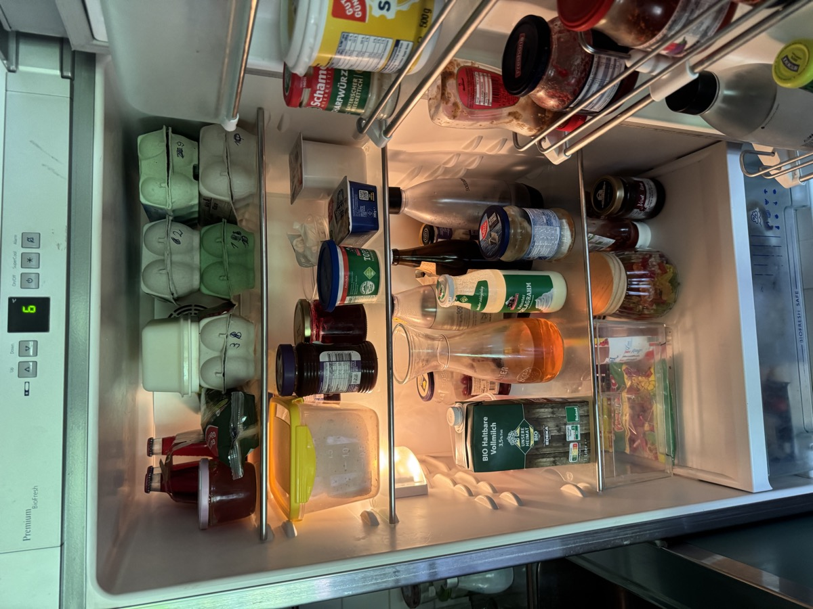

# Evidence W2: Multimodale Eingabe — Kühlschrank-Foto → Zutaten → Rezept

> **Hinweis (2026-08-02):** Dieser Nachweis entstand mit dem VLM
> `llama-4-scout`, das Groq inzwischen zurückgezogen hat; aktuell nutzt das
> System `qwen/qwen3.6-27b` für Text **und** Vision (Modell-Drift, siehe
> [reflexion_drift.md](../reflexion_drift.md)). Die Neuerzeugung mit dem
> Nachfolger (`python scripts/erzeuge_vision_evidence.py`) scheiterte am
> 2026-08-02 am Groq-Tages-Token-Limit (TPD, durch den Eval-Re-Run desselben
> Tags aufgebraucht) und wird mit frischem Tagesbudget nachgeholt — das Skript
> überschreibt dann diese Datei samt Hinweis.

*Realer Lauf am 2026-07-15 mit echtem Foto und echten API-Keys
(Groq-VLM `meta-llama/llama-4-scout-17b-16e-instruct`
für die Zutatenerkennung, danach der normale Agenten-Lauf). Reproduzierbar über
`python scripts/erzeuge_vision_evidence.py`. Leeres Profil, damit der Nachweis
allein die Bildverarbeitung belegt.*

## 1. Eingabe-Foto (echter Kühlschrank)

Anfrage dazu: „Was kann ich aus meinem Kühlschrank kochen? Nutze, was auf dem Foto zu sehen ist.“

## 2. Vom VLM erkannte Zutaten (10)

- Eier
- Milch
- Käse
- Senf
- Ketchup
- Marmelade
- Salat
- Bier
- Essig
- Öl

*(Ablauf: Das Vision-Tool wandelt das Foto VOR dem Agenten-Lauf in diese
Zutatenliste um — der Orchestrator bleibt rein text-/tool-basiert, siehe
`app/tools/vision.py`. Die Liste wird der Nachricht angehängt.)*

## 3. Trajektorie des anschließenden Agenten-Laufs

recherche_rezepte → einkaufsliste_erstellen — Roh-Trace: [traces/vision_lauf.json](traces/vision_lauf.json)

## 4. Daraus entstandener Rezeptvorschlag

**Rezeptvorschlag: Eier-Käse-Salat**  
**Zutaten**:  
- 4 Eier (hart gekocht und gewürfelt)  
- 200g Käse (fein gehobelt)  
- 1 EL Senf  
- 2 EL Essig  
- 1 EL Öl  
- 1 Gurke (gewürfelt, *Einkaufsliste: Gurken*)  
- Salz, Pfeffer, Zucker nach Geschmack  

**Zubereitung**:  
1. Eier hart kochen, abkühlen lassen und in Würfel schneiden.  
2. Käse fein hobeln, Gurke in kleine Würfel schneiden.  
3. Senf, Essig, Öl, Salz, Pfeffer und Zucker zu einer Dressing-Mischung rühren.  
4. Alle Zutaten in eine Schüssel geben, mit der Dressing-Mischung vermengen und servieren.  

**Einkaufsliste**:  
- Gurken (1 Stück)  

*Hinweis: Das Rezept ist für 2 Portionen angegeben. Bei Bedarf kann es mit `portionen_skalieren` umgerechnet werden.*
